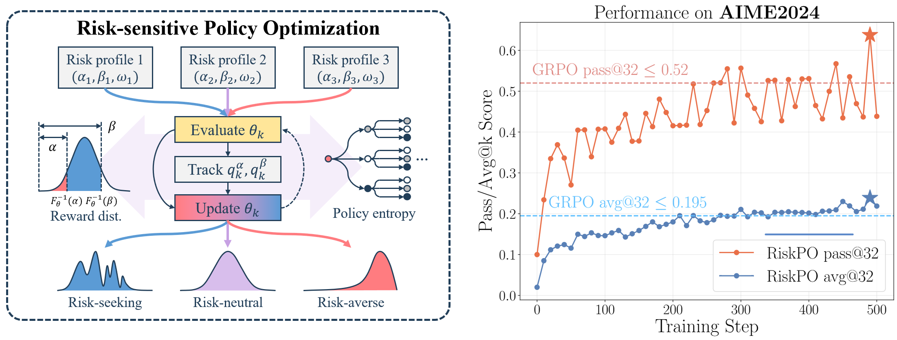
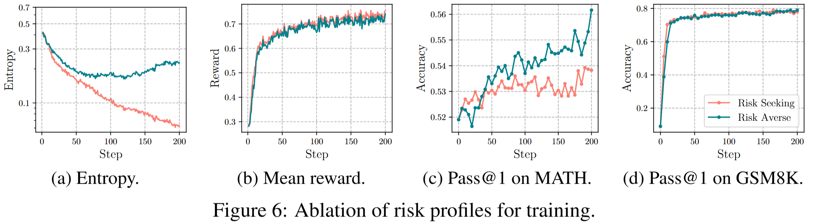
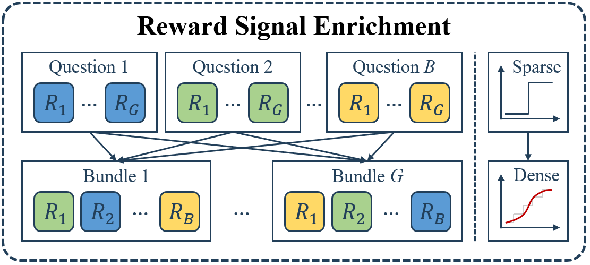

<h1 style="text-align: center;">RiskPO: Risk-Based Policy Optimization via
Verfiable Reward for LLM Post-Training</h1>

<div align="center">


</div>

# Overview
Risk-based Policy Optimization (RiskPO) substitutes classical mean-based objectives with principled risk measures. Specifically, we introduce a Mixed Value-at-Risk (MVaR) objective that integrates weighted attention over multiple regions of the reward distribution, thereby amplifying gradient signals on challenging instances and preventing overconfident convergence. We further design a bundling scheme that aggregates multiple questions into bundles, thus enriching the feedback signal and yielding more stable and informative training dynamics.

# Get Started
## Installation
```bash
conda create -n RiskPO python=3.10 -y
conda activate RiskPO

pip install torch==2.6.0 --index-url https://download.pytorch.org/whl/cu122
wget -nv https://github.com/Dao-AILab/flash-attention/releases/download/v2.7.4.post1/flash_attn-2.7.4.post1+cu12torch2.6cxx11abiFALSE-cp310-cp310-linux_x86_64.whl && \
pip install --no-cache-dir flash_attn-2.7.4.post1+cu12torch2.6cxx11abiFALSE-cp310-cp310-linux_x86_64.whl

cd RiskPO
pip install -e .
```

## Data Preparation
We provide script to download DAPOMATH-17K, MATH, and GSM8K datasets.

To download the hard-level math dataset (DAPOMATH-17K).
```bash
python ./data_processing/download_dapomath.py
```

To download the easy-level math datasets (MATH and GSM8K).
```bash
python ./data_processing/download_easymath.py
```

## Training
Start the training on the hard-level math dataset with [`DeepSeek-R1-Distill-Qwen-1.5B`](https://huggingface.co/deepseek-ai/DeepSeek-R1-Distill-Qwen-1.5B).
```bash
bash ./scripts/run_qwen2.5_1.5b_MVaR_dapomath.sh
```

Start the training on the easy-level math dataset with [`Qwen2.5-1.5B-Instruct`](https://huggingface.co/Qwen/Qwen2.5-1.5B-Instruct).
```bash
bash ./scripts/run_qwen2.5_1.5b_MVaR_math.sh
```

Begin training with the risk-seeking objective. Note that during risk-seeking training, a rapid collapse of entropy can be observed.
```bash
bash ./scripts/run_qwen2.5_1.5b_risky_MVaR_math.sh
```
The following figures shows the results of risk-seeking optimization. It suggests that over-optimizing the well-learned data is detrimental to the training.
<div align="left">
  
</div>

# Implementation Details
The core logic of RiskPO is implemented in the `compute_grpo_bundle_rvar_outcome_advantage_quantile_tracking` function within `verl/trainer/ppo/core_algos.py`, as well as in supporting routines in `verl/trainer/ppo/ray_trainer.py`. These modules offer the following essential features:

**1. Risk-Averse Objective:**  
`quantile_up` and `quantile_down` are the predefined quantile level. `q_down` and `q_up` are the quantile value from the quantile tracking. The core codes below is for computing the risk-averse advantage.

```python
paper_advantage = torch.clamp(paper_score - q_down, min=0) - torch.clamp(paper_score - q_up, min=0) + q_down - q_up
paper_advantage /= (quantile_up - quantile_down + epsilon)

if use_mixing_risk_measure:
    cvar_advantage = - torch.clamp(q_down - paper_score, min=0)
    cvar_advantage = cvar_advantage / (quantile_down + epsilon)

    paper_advantage = (w_mix * cvar_advantage + paper_advantage)/(w_mix + 1)
```

**2. Bundle Technique:**  
Similar to the group id in the GRPO, we use the `uuid` to group several question to a bundle. The advantage is computed based on the bundle.
```python
bundle_uid = []
bundle_size = self.config.algorithm.bundle_size
for i in range(len(batch.batch)):
    if i % bundle_size == 0:
        temp_uid = uuid.uuid4()
        bundle_uid.append(temp_uid)
    else:
        bundle_uid.append(bundle_uid[-1])
batch.non_tensor_batch["bundle_uid"] = np.array(bundle_uid, dtype=object)
```
The following figure illustrate the idea of bundling.
<div align="left">
  
</div>

**3. Quantile Tracking:**  
We use the classic stochastice approximation technique to track the quantile of interest. It is a essentially a SGD online optimization process.

```python
self.alpha_list = torch.tensor([0.05, 0.1, 0.15, 0.2, 0.25, 0.3, 0.35, 0.4, 0.45, 0.5, 0.55, 0.6, 0.65, 0.7, 0.75, 0.8, 0.85, 0.9, 0.95])
self.q = torch.nn.Parameter(torch.zeros_like(self.alpha_list).clone(), requires_grad=True)
self.optimizer_q = torch.optim.SGD([self.q], lr=self.config.algorithm.lr_q)

...

self.q.grad = -(self.alpha_list - (bundle_paper_scores_flat < self.q.unsqueeze(1)).float().mean(dim=1))

self.optimizer_q.step()
self.optimizer_q.zero_grad()
```


# Acknowledgements

- We build our model upon [`DeepSeek-R1-Distill-Qwen-1.5B`](https://huggingface.co/deepseek-ai/DeepSeek-R1-Distill-Qwen-1.5B) and [`Qwen2.5-1.5B-Instruct`](https://huggingface.co/Qwen/Qwen2.5-1.5B-Instruct).
- Training was carried out with a modified version of [verl](https://github.com/volcengine/verl).
- We thank [ArcherCodeR](https://github.com/wizard-III/ArcherCodeR) for their open-source project.

# Contacts and Citation
If you have any question about our work or this repository, please don't hesitate to contact us by emails or open an issue under this project.

- [rtkenny@stu.pku.edu.cn](rtkenny@stu.pku.edu.cn)
- [jyjiang.ai@gmail.com](jyjiang.ai@gmail.com)

Please cite the following:

```bibtex
@article{ren2025riskpo,
  title={RiskPO: Risk-based Policy Optimization via Verifiable Reward for LLM Post-Training},
  author={Ren, Tao and Jiang, Jinyang and Yang, Hui and Tian, Wan and Zou, Minhao and Li, Guanghao and Zhang, Zishi and Wang, Qinghao and Qin, Shentao and Zhao, Yanjun and others},
  journal={arXiv preprint arXiv:2510.00911},
  year={2025}
}